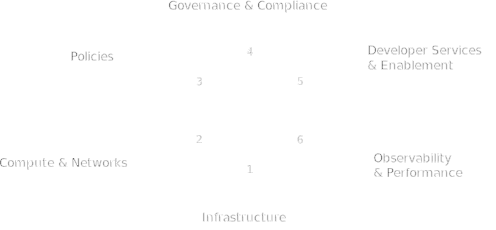

## Key Component Groups of a Cloud Platform
A cloud platform can be broken down into six distinct component groups.  The below sections capture the six key components groups of a cloud platform:

&nbsp;
&nbsp;

{.light-only}
{.dark-only}

### 1. **Infrastructure**
Foundational elements of the cloud platform, detailing how different environments and resources are configured and managed.

- **Providers:** Specifies the cloud providers (e.g., AWS, Azure, GCP) and their associated configurations, such as regions, availability zones, and resource quotas.
- **Environments:** Describes the different environments (e.g., development, staging, production) and their specific configurations, ensuring consistency across multiple environments.
- **Credentials:** Manages the authentication and access credentials for interacting with cloud providers and services, emphasizing secure storage and rotation policies.

### **2. Compute and Networks**
Resources that provide the computational power and networking capabilities required by applications and services.

- **Servers:** Specifies the virtual machines or physical servers, including instance types, sizes, and operating systems, along with configurations for scaling and high availability.
- **Clusters:** Defines clusters of servers, such as Kubernetes clusters, detailing their configuration, node pools, scaling policies, and networking setup.
- **Machine Images:** Defines the machine images (e.g., AMIs for AWS, VM images for GCP) used for spinning up virtual machines, ensuring consistency in the base operating systems and software configurations.
- **Managed Services:** Describes managed services like databases, caching services, and message queues, including their configurations and integration points with other platform components.
- **Software Package Groups:** Groups related software components, such as middleware, libraries, and runtime environments, ensuring consistent deployment across environments.

### **3. Policies**
This section outlines the policies that govern the operation, management, and security of the cloud platform.

- **Cost Management:** Defines policies for tracking, managing, and optimizing cloud costs, including budgeting, alerting, and chargeback mechanisms.
- **Logging:** Specifies logging policies, including what logs are collected, where they are stored, and how they are retained and analyzed.
- **Scaling:** Outlines the scaling policies for compute and storage resources, detailing thresholds, triggers, and automation rules.
- **Monitoring:** Defines monitoring policies, including metrics to be collected, alerting thresholds, and the integration of monitoring tools.
- **Backup and Disaster Recovery:** Describes backup strategies and disaster recovery plans, including frequency, retention, and recovery point objectives (RPOs).
- **Alerting:** Specifies alerting mechanisms, including notification channels, severity levels, and escalation procedures.
- **Governance:** Outlines governance policies, including access controls, compliance requirements, and audit trails.

### **4. Security and Compliance**
Configuration and specifications for ensuring that the cloud platform meets security and compliance requirements, safeguarding data and infrastructure.

- **Identity and Access Management (IAM):** Details the policies and configurations for managing user identities, roles, and permissions, ensuring least privilege access.
- **Data Encryption:** Specifies encryption standards for data at rest and in transit, including key management and rotation policies.
- **Compliance:** Describes compliance requirements (e.g., GDPR, HIPAA) and how the platform adheres to them, including audit trails and documentation.
- **Vulnerability Management:** Outlines processes for identifying, assessing, and mitigating security vulnerabilities in the platform’s infrastructure and applications.

### **5. Developer Services and Enablement**
Tools and environments that enhance the developer experience, making it easier to build, test, and deploy applications.

- **Application and API Services**: Specifies platform provided or enabled services that expand the developer's capability to leverage the underlying components of the Infrastructure as a Service provider(s) and core platform services, such as service meshes, API gateways, databases as a service, serverless function orchestration systems, message queue's, and more.
- **CI/CD Pipelines:** Describes the continuous integration and deployment pipelines, including tools, workflows, and integration with version control systems.
- **Developer Portals:** Defines the self-service portals that provide developers with access to resources, documentation, and automated workflows for environment setup and application deployment.
- **SDKs and APIs:** Outlines the software development kits (SDKs) and application programming interfaces (APIs) available to developers for interacting with the platform’s services.

### **6. Observability and Performance**
For ensuring that the cloud platform and the applications running on it are observable and performant.

- **Telemetry:** Defines what telemetry data is collected from the platform and applications, including metrics, logs, and traces.
- **Performance Tuning:** Outlines strategies and tools for tuning the performance of applications and infrastructure, including load testing and optimization techniques.
- **Service Level Objectives (SLOs):** Specifies the service level objectives for critical platform services, including uptime, latency, and response times, and the mechanisms for monitoring and achieving these objectives.
- **Cost Management and Optimization:** Ttools to monitor and optimize resource usage, ensuring that infrastructure and applications are cost-efficient and sustainable. Delivers insights into cloud spending, helping executives manage budgets, forecast expenses, and make informed financial decisions.

## **Types of Cloud Platforms:**

Cloud platforms can be categorized based on several factors, including their origin (custom-built vs. off-the-shelf), their deployment model (self-hosted vs. managed/hosted), and their specific use cases. The type of cloud platform an organization chooses depends on its specific needs, resources, and strategic goals. Custom, internal platforms offer unparalleled flexibility and control but come with higher development costs. Off-the-shelf solutions provide ease of use and quick deployment at the cost of customization. Hosted platforms offer convenience and scalability but limit control, while self-hosted platforms give full control at the expense of increased complexity and resource requirements. Understanding these types and their trade-offs is crucial for making informed decisions about cloud platform strategy.

Below are the different types of cloud platforms, along with a description and explanation of each:

### **1. Custom, Internal, and Homegrown Cloud Platforms**

#### **Definition:**
Custom, internal, and homegrown cloud platforms are built and maintained entirely by an organization’s internal teams. These platforms are tailored specifically to the unique needs and requirements of the organization, often integrating tightly with existing systems, workflows, and processes.

#### **Description:**
- **Customization:** These platforms are highly customized, often built from the ground up to address specific business requirements or technical challenges that off-the-shelf solutions may not adequately cover.
- **Control:** Organizations have full control over every aspect of the platform, from infrastructure management to feature development, allowing for deep integration with internal tools and services.
- **Flexibility:** Custom platforms offer significant flexibility, enabling organizations to implement unique features and optimizations that provide a competitive advantage.

#### **Use Cases:**
- Organizations with specialized needs that cannot be met by commercial solutions.
- Enterprises looking to leverage proprietary technology or data in a way that requires complete control over the platform.

#### **Challenges:**
- **Development and Maintenance Costs:** Building and maintaining a custom platform requires significant investment in time, resources, and expertise.
- **Scalability:** Custom platforms may face challenges in scaling efficiently as the organization grows, particularly if they were not designed with scalability in mind from the outset.

### **2. Off-the-Shelf Commercial Cloud Platforms**

#### **Definition:**
Off-the-shelf commercial cloud platforms are pre-built solutions provided by third-party vendors. These platforms are designed to be widely applicable across different industries and use cases, offering a standardized set of features and capabilities.

#### **Description:**
- **Simplicity:** These platforms are ready to use out of the box, with pre-configured features and services that can be quickly deployed without the need for extensive customization.
- **Support and Upgrades:** Vendors typically provide ongoing support, regular updates, and new features, reducing the operational burden on the organization.
- **Integration:** Many off-the-shelf platforms come with a wide range of integrations with popular third-party tools and services, making it easier to adopt and extend the platform.

#### **Use Cases:**
- Organizations looking for a quick, reliable, and cost-effective solution to deploy cloud infrastructure or applications.
- Businesses that do not have the resources or expertise to build and maintain a custom cloud platform.

#### **Challenges:**
- **Limited Customization:** While these platforms offer many features, they may not be easily customizable to fit very specific needs.
- **Vendor Lock-In:** Relying on a commercial platform can lead to vendor lock-in, where the organization becomes dependent on a single provider, making it difficult to switch platforms or providers in the future.

### **3. Hosted (Managed) Cloud Platforms**

#### **Definition:**
Hosted or managed cloud platforms are solutions where the infrastructure and platform services are fully managed by a third-party provider. These platforms relieve organizations from the responsibility of maintaining the underlying infrastructure, allowing them to focus on their core business.

#### **Description:**
- **Ease of Use:** Managed platforms are designed for ease of use, with the provider handling all aspects of infrastructure management, including setup, scaling, security, and maintenance.
- **Scalability:** Providers typically offer scalable solutions that can grow with the organization’s needs, without requiring significant input from the organization itself.
- **Cost-Effectiveness:** While managed platforms may have a higher upfront cost, they can be cost-effective in the long run by reducing the need for in-house IT staff and infrastructure investments.

#### **Use Cases:**
- Organizations that want to focus on application development and business growth rather than infrastructure management.
- Startups and small businesses that need a robust platform without the overhead of managing it themselves.

#### **Challenges:**
- **Less Control:** Organizations have limited control over the underlying infrastructure and must rely on the provider’s capabilities and policies.
- **Data Security:** While managed platforms often have strong security measures, organizations may have concerns about data privacy and compliance, especially in highly regulated industries.

### **4. Self-Hosted Cloud Platforms**

#### **Definition:**
Self-hosted cloud platforms are solutions where the organization is responsible for deploying, managing, and maintaining the platform on its own infrastructure or on cloud infrastructure that they control.

#### **Description:**
- **Full Control:** Organizations have complete control over the platform, including the ability to customize, configure, and optimize it according to their specific needs.
- **Security:** Self-hosted platforms allow organizations to implement their own security measures, ensuring that they meet internal policies and regulatory requirements.
- **Cost:** While self-hosting can be more expensive upfront, it can offer long-term savings by avoiding the recurring costs associated with managed services.

#### **Use Cases:**
- Organizations with specific security, compliance, or performance requirements that necessitate full control over the platform.
- Enterprises with the resources and expertise to manage complex infrastructure environments.

#### **Challenges:**
- **Resource Intensive:** Self-hosting requires significant investment in infrastructure, personnel, and expertise to manage and maintain the platform effectively.
- **Complexity:** Managing a self-hosted platform can be complex, particularly in environments that require high availability, redundancy, and scalability.

