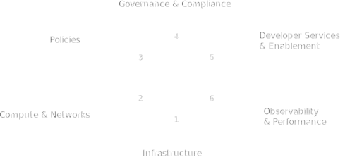

# Key Pillars of a Cloud Platform
We've captured the different layers that compose the software and services within a cloud platform, but that's not all that's involved.  There's more -- from configurations regarding behavior and expectations of components within the platform, to precanned solutions of systems available within the platform.  Much more work needs to take place in order to capture and define these elements of a cloud platform, instead of solely representing the services and software selected at each layer.

To make this happen, we can break down "what makes a cloud paltform" into six distinct key pillars of important definitions, characteristics, and structural elements that support the platform.

&nbsp;
&nbsp;

{.light-only}
{.dark-only}

The key pillars are as follows:

## 1. **Infrastructure**
Foundational elements of the cloud platform, detailing how different environments and resources are configured and managed.

- **Providers:** Specifies the cloud providers (e.g., AWS, Azure, GCP) and their associated configurations, such as regions, availability zones, and resource quotas.
- **Environments:** Describes the different environments (e.g., development, staging, production) and their specific configurations, ensuring consistency across multiple environments.
- **Credentials:** Manages the authentication and access credentials for interacting with cloud providers and services, emphasizing secure storage and rotation policies.

## **2. Compute and Networks**
Resources that provide the computational power and networking capabilities required by applications and services.

- **Servers:** Specifies the virtual machines or physical servers, including instance types, sizes, and operating systems, along with configurations for scaling and high availability.
- **Clusters:** Defines clusters of servers, such as Kubernetes clusters, detailing their configuration, node pools, scaling policies, and networking setup.
- **Machine Images:** Defines the machine images (e.g., AMIs for AWS, VM images for GCP) used for spinning up virtual machines, ensuring consistency in the base operating systems and software configurations.
- **Managed Services:** Describes managed services like databases, caching services, and message queues, including their configurations and integration points with other platform components.
- **Software Package Groups:** Groups related software components, such as middleware, libraries, and runtime environments, ensuring consistent deployment across environments.

## **3. Policies**
This section outlines the policies that govern the operation, management, and security of the cloud platform.

- **Cost Management:** Defines policies for tracking, managing, and optimizing cloud costs, including budgeting, alerting, and chargeback mechanisms.
- **Logging:** Specifies logging policies, including what logs are collected, where they are stored, and how they are retained and analyzed.
- **Scaling:** Outlines the scaling policies for compute and storage resources, detailing thresholds, triggers, and automation rules.
- **Monitoring:** Defines monitoring policies, including metrics to be collected, alerting thresholds, and the integration of monitoring tools.
- **Backup and Disaster Recovery:** Describes backup strategies and disaster recovery plans, including frequency, retention, and recovery point objectives (RPOs).
- **Alerting:** Specifies alerting mechanisms, including notification channels, severity levels, and escalation procedures.
- **Governance:** Outlines governance policies, including access controls, compliance requirements, and audit trails.

## **4. Security and Compliance**
Configuration and specifications for ensuring that the cloud platform meets security and compliance requirements, safeguarding data and infrastructure.

- **Identity and Access Management (IAM):** Details the policies and configurations for managing user identities, roles, and permissions, ensuring least privilege access.
- **Data Encryption:** Specifies encryption standards for data at rest and in transit, including key management and rotation policies.
- **Compliance:** Describes compliance requirements (e.g., GDPR, HIPAA) and how the platform adheres to them, including audit trails and documentation.
- **Vulnerability Management:** Outlines processes for identifying, assessing, and mitigating security vulnerabilities in the platform’s infrastructure and applications.

## **5. Developer Services and Enablement**
Tools and environments that enhance the developer experience, making it easier to build, test, and deploy applications.

- **Application and API Services**: Specifies platform provided or enabled services that expand the developer's capability to leverage the underlying components of the Infrastructure as a Service provider(s) and core platform services, such as service meshes, API gateways, databases as a service, serverless function orchestration systems, message queue's, and more.
- **CI/CD Pipelines:** Describes the continuous integration and deployment pipelines, including tools, workflows, and integration with version control systems.
- **Developer Portals:** Defines the self-service portals that provide developers with access to resources, documentation, and automated workflows for environment setup and application deployment.
- **SDKs and APIs:** Outlines the software development kits (SDKs) and application programming interfaces (APIs) available to developers for interacting with the platform’s services.

## **6. Observability and Performance**
For ensuring that the cloud platform and the applications running on it are observable and performant.

- **Telemetry:** Defines what telemetry data is collected from the platform and applications, including metrics, logs, and traces.
- **Performance Tuning:** Outlines strategies and tools for tuning the performance of applications and infrastructure, including load testing and optimization techniques.
- **Service Level Objectives (SLOs):** Specifies the service level objectives for critical platform services, including uptime, latency, and response times, and the mechanisms for monitoring and achieving these objectives.
- **Cost Management and Optimization:** Ttools to monitor and optimize resource usage, ensuring that infrastructure and applications are cost-efficient and sustainable. Delivers insights into cloud spending, helping executives manage budgets, forecast expenses, and make informed financial decisions.

