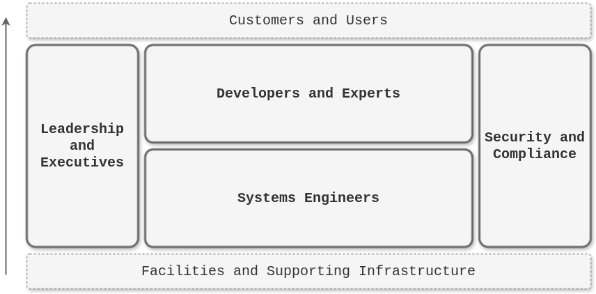
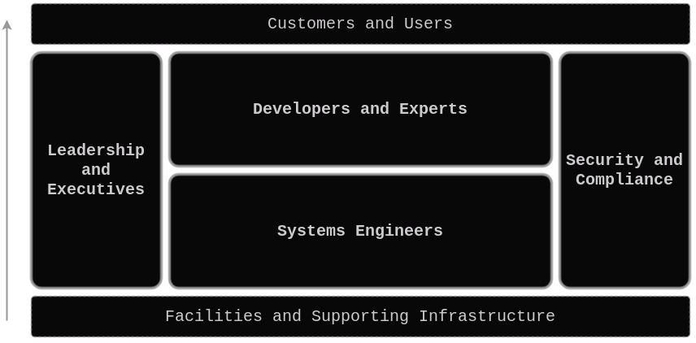

# **Stakeholder Groups of a Cloud Platform**

Cloud platforms serve multiple stakeholder groups within an organization, each with its own unique priorities, concerns, and responsibilities. Understanding these groups and their roles is essential for designing and managing a cloud platform that meets the needs of the entire organization. Here’s a detailed description of the four primary stakeholder groups:

{.light-only}
{.dark-only}

## **1. Systems Engineers**

> *The people who enable your organization, such as DevOps, SRE, Platform/Infrastructure/Cloud Engineers.*

**Role and Responsibilities:**
Systems Engineers are responsible for the design, deployment, operation, and maintenance of the cloud platform’s underlying infrastructure. This group includes DevOps Engineers, Site Reliability Engineers (SREs), Platform Engineers, Infrastructure Engineers, and Cloud Engineers. Their primary focus is on ensuring that the cloud platform is robust, scalable, and efficient, providing a solid foundation for applications and services.

**Key Priorities:**
- **Automation and Efficiency:** Systems Engineers prioritize automating infrastructure provisioning and management to reduce manual tasks, minimize errors, and increase operational efficiency.
- **Reliability and Scalability:** They ensure that the platform is reliable, with high availability and the ability to scale as needed to handle varying workloads.
- **Performance Monitoring:** Continuous monitoring of system performance and the ability to quickly identify and resolve issues are crucial for maintaining service levels.
- **Infrastructure as Code (IaC):** They leverage IaC tools to codify and automate the deployment of infrastructure, enabling consistency and repeatability across environments.

**Concerns:**
- **Downtime and Failures:** Minimizing downtime and preventing infrastructure failures are critical concerns, as they directly impact the organization’s operations.
- **Complexity Management:** Managing the complexity of cloud environments, especially in multi-cloud or hybrid scenarios, is a significant challenge.
- **Resource Optimization:** Ensuring that resources are used efficiently to avoid waste and control costs is a constant concern.

## **2. Developers and Experts**

> *The people who create the value of your organization, such as full-stack, front/back-end developers, ML/AI engineers, and more.*

**Role and Responsibilities:**
Developers are responsible for building, testing, and deploying applications that run on the cloud platform. Their primary focus is on writing code, developing features, and delivering software that meets user needs. Developers rely on the cloud platform to provide the tools, environments, and services they need to be productive and to deploy their applications quickly and reliably.

**Key Priorities:**
- **Ease of Use:** Developers prioritize having easy access to development tools, environments, and resources that allow them to focus on coding without being bogged down by infrastructure concerns.
- **Speed of Deployment:** They value fast, automated deployment processes that enable them to quickly release new features and updates.
- **Self-Service Capabilities:** Developers benefit from self-service portals that allow them to provision resources, access APIs, and deploy applications independently, without waiting for IT support.
- **Integration with CI/CD Pipelines:** Seamless integration with continuous integration and continuous delivery (CI/CD) pipelines is crucial for maintaining efficient development workflows.

**Concerns:**
- **Development Bottlenecks:** Any obstacles that slow down the development process, such as waiting for resources or dealing with complex configurations, are major concerns for developers.
- **Environment Consistency:** Ensuring that development, staging, and production environments are consistent is important for preventing issues during deployment.
- **Application Performance:** Developers need to ensure that their applications perform well and are optimized for the cloud platform.

## **3. Security and Compliance**

> *The people who preserve the value of your organization, such as Security and Legal departments*

**Role and Responsibilities:**
The Security and Compliance team is responsible for ensuring that the cloud platform and the applications running on it adhere to organizational security policies and industry regulations. This group focuses on protecting the platform from security threats, managing access controls, and ensuring that the organization remains compliant with relevant laws and standards.

**Key Priorities:**
- **Access Control:** Security and Compliance teams prioritize implementing and managing strict access controls to ensure that only authorized users can access sensitive data and resources.
- **Data Protection:** They ensure that data is securely stored and transmitted, using encryption and other security measures to protect against breaches and data loss.
- **Compliance Adherence:** Maintaining compliance with industry regulations (e.g., GDPR, HIPAA) is a top priority, requiring ongoing monitoring, auditing, and documentation.
- **Vulnerability Management:** Regularly scanning for and addressing vulnerabilities in the platform and applications is essential for minimizing security risks.

**Concerns:**
- **Security Breaches:** Preventing unauthorized access, data breaches, and other security incidents is a constant concern for this group.
- **Compliance Violations:** Failing to meet compliance requirements can result in legal penalties, fines, and reputational damage, making this a significant concern.
- **Audit Readiness:** Ensuring that the platform is always audit-ready, with comprehensive logs and documentation, is critical for maintaining compliance.

## **4. Leadership and Executives**

> *The people who drive your organization, such as Directors, Vice Presidents, and higher.*

**Role and Responsibilities:**
Leadership and Executives are responsible for setting the strategic direction of the organization and ensuring that the cloud platform aligns with business goals. They focus on high-level outcomes, such as driving innovation, optimizing costs, and ensuring that the platform supports the organization’s growth and competitive advantage.

**Key Priorities:**
- **Business Alignment:** Executives prioritize ensuring that the cloud platform supports the organization’s strategic objectives, enabling innovation and agility.
- **Cost Management:** Controlling and optimizing cloud costs is a major priority, as it directly impacts the organization’s bottom line.
- **Risk Management:** Leadership is concerned with mitigating risks related to security, compliance, and operational continuity to protect the organization’s reputation and assets.
- **Performance Metrics:** Executives focus on key performance indicators (KPIs) that measure the effectiveness and efficiency of the cloud platform, such as uptime, deployment frequency, and cost efficiency.

**Concerns:**
- **Return on Investment (ROI):** Ensuring that investments in the cloud platform deliver tangible business value and a strong ROI is a primary concern.
- **Scalability and Growth:** The ability of the cloud platform to scale with the organization’s growth and support new initiatives is crucial for long-term success.
- **Regulatory and Market Changes:** Keeping the platform adaptable to changing regulatory requirements and market conditions is a constant concern for leadership.

## **Summary**

These four stakeholder groups each play a critical role in the success of a cloud platform. Understanding their distinct priorities and concerns is essential for designing, implementing, and managing a cloud platform that meets the needs of the entire organization, drives innovation, and ensures operational excellence.
