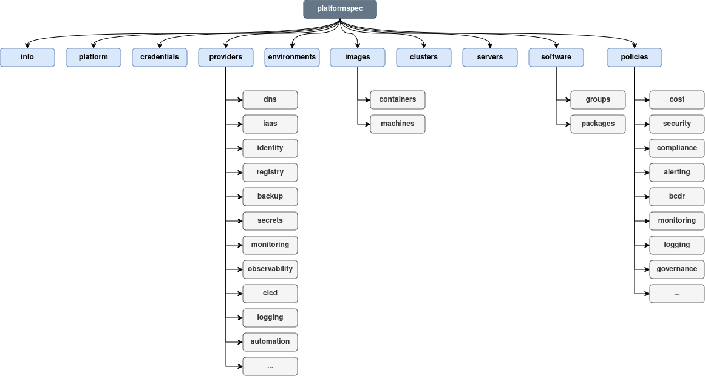

# Getting Started

## Introduction
The Platform Specification is a [YAML](https://yaml.org)-based, community-driven standard for defining cloud platforms. It provides a structured, consistent approach to specifying all the key components, configurations, and policies needed to deploy and manage a cloud platform across multiple environments. This specification is designed to improve the efficiency of platform management by ensuring clarity, modularity, and scalability from the start.
Introduction to YAML in the Platform Specification

The Platform Specification uses [YAML](https://yaml.org) as the format for defining platform components. YAML is chosen for its human-readable syntax and ability to represent complex data structures easily. In this specification, YAML files are used to define various aspects of the platform, such as infrastructure, compute, policies, and more.

## Root Elements
{.light-only}
{.dark-only}

The Platform Specification is divided into several key sections, each capturing different dimensions of a cloud platform. Let’s walk through these sections:


### Version
Every platform specification document __must__ contain a root level entry of `platformspec` that specifies the version of the spec used within:

```
platformspec: "v1alpha1"
```

### Info
The `info` root element contains metadata information about the document itself. 

```yaml
info:
  title: Example Platform on AWS
  version: "0.0.1"
  description: "A comprehensive example of an AWS based Kubernetes platform."
```

It has the following fields:

  * `title` __(required)__: Human readable title name of the Platform defined within this document
  * `version` __(required)__: A version of the platform, internal to the team definining and managing the platform.
  * `description` __(optional)__: Brief description about the Platform.

### Platform
The `platform` root element in the Platform Specification YAML defines fundamental information about the cloud platform being described. This includes its name, organization details, contact information, and DNS configuration.

The `platform` root element has the following fields:

  * `name` __(required)__: A unique identifier for the platform.
  * `organization` __(required)__: The name of the organization responsible for the platform.
  * `contactEmail` __(required)__: Email address for contacting the platform's administrators.
  * `dns`:
    * `provider` __(required)__: Refers to a predefined DNS provider defined in the providers section of the specification. This ensures consistency and avoids hardcoding specific DNS services.
    * `domain` __(required)__: The top-level domain name associated with the platform.

Example:

```yaml
platform:
  name: example
  organization: Example Demo Company
  contactEmail: engineering@foundation.io
  dns:
    provider: "#/providers/dns/route53"
    domain: example.com
```


### Credentials
The credentials section in the Platform Specification YAML defines how authentication credentials are managed for various cloud services. This allows for flexible configuration and secure storage of sensitive information.

The `credentials` root element has the following fields::

  * `<credential-name>` __(required)__: A unique identifier for the credential set. This allows multiple credential sets to be defined within the same platform specification (e.g., for different AWS accounts).
    * `schema` __(optional)__: Specifies the format of the credentials according to a predefined schema. This ensures compatibility with specific cloud services.
    * `source` __(required)__: Defines where the credentials are retrieved from. Supported sources may include environment variables, secret managers, or hardcoded values within the YAML file.
    * `fields` __(optional)__: key-value pairs defining individual credential fields and how they map to their source values.

Example:

```yaml
credentials:
  aws-creds:
    schema: AWS
    source: environment
    fields:
      AWS_ACCESS_KEY_ID: $AWS_ACCESS_KEY_ID
      AWS_SECRET_ACCESS_KEY: $AWS_SECRET_ACCESS_KEY
```

The credentials section enables secure handling of authentication information by separating it from the platform configuration.  Referencing external secret managers can further enhance security by storing credentials outside the main configuration file.


### Policies

The Policies section governs the operational and cost-management aspects of the platform. Policies may include logging, scaling, backups, or disaster recovery strategies. This ensures that critical governance and operational practices are well defined and consistently applied.


```yaml
# TBD

```

