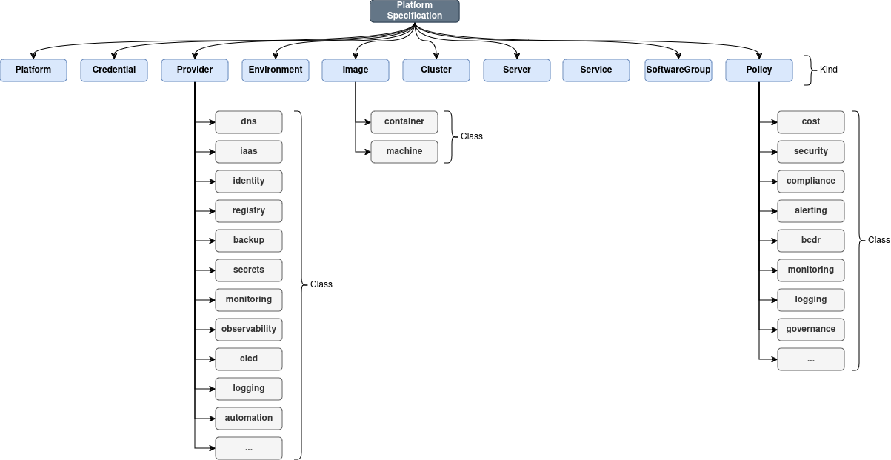
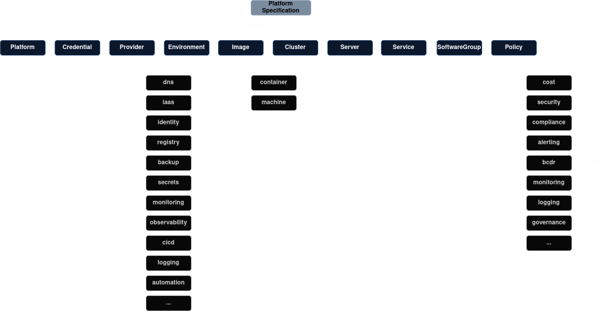

# The Specification

## Introduction
The Platform Specification is a [YAML](https://yaml.org)-based, community-driven standard for defining cloud platforms. It provides a structured, consistent approach to specifying all the key components, configurations, and policies needed to deploy and manage a cloud platform across multiple environments. This specification is designed to improve the efficiency of platform management by ensuring clarity, modularity, and scalability from the start.
Introduction to YAML in the Platform Specification

The Platform Specification uses [YAML](https://yaml.org) as the format for defining platform components. YAML is chosen for its human-readable syntax and ability to represent complex data structures easily. In this specification, YAML files are used to define various aspects of the platform, such as infrastructure, compute, policies, and more.

> [!WARNING]
> The specification is still a work in process and is being actively designed.

## Document Structure
The Platform Specification document follows a hierarchical structure that clearly defines all key aspects of a cloud platform. This organized approach ensures consistency, clarity, and maintainability.

{.light-only}
{.dark-only}

Each root element represents a fundamental aspect of the platform:

  * **`info`**: Provides high-level metadata about the platform specification itself document, including its version, author, description, and copyright information.
  * **`platform`**: Defines essential details about the cloud platform, such as its name, organization, contact information, and DNS configuration.
  * **`credentials`**: Outlines how authentication credentials for various cloud services are managed, specifying sources (e.g., environment variables) and mapping credential fields.
  * **`providers`**: Defines a registry of supported cloud service providers (Iaas, DNS, IAM, etc.) with their configuration options and required credentials.
  * **`environments`**: Specifies the different deployment environments for the platform (e.g., development, staging, production), outlining configurations unique to each environment.
  * **`images`**: Describes both machine images and container images used for deploying applications and infrastructure within the platform. Includes details about operating systems, software versions, and other relevant information.
  * **`clusters`**: Defines Kubernetes or other cluster deployments, including their configuration, node pools, and networking settings.
  * **`servers`**: Describes individual servers that make up the platform's infrastructure, including server specifications, network configurations, and operating system details.
  * **`software`**: Lists the software applications and libraries required for the platform to function correctly, along with their versions and dependencies.
  * **`policies`**: Defines security policies, compliance requirements, and other governance rules that govern the platform's operation.

The Platform Specification document structure promotes a modular and organized approach to defining complex cloud platforms, ensuring clarity, maintainability, and consistency across different environments and deployments.

Let’s walk through these elements:

## Version
Every platform specification document __must__ contain a root level entry of `platformspec` that specifies the version of the spec used within:

```yaml
platformspec: "v1alpha1"
```

## Info
The `info` root element contains metadata information about the document itself. 

```yaml
info:
  title: Example Platform on AWS
  version: "0.0.1"
  description: "A comprehensive example of an AWS based Kubernetes platform."
  author: Josh West
```

It has the following fields:

  * **`title`** __(required)__: Human readable title name of the Platform defined within this document
  * **`version`** __(required)__: A version of the platform, internal to the team definining and managing the platform.
  * **`description`** __(optional)__: Brief description about the Platform.
  * **`author`** __(optional)__: Author of the platform specification document.

## Platform
The `platform` root element in the Platform Specification YAML defines fundamental information about the cloud platform being described. This includes its name, organization details, contact information, and DNS configuration.

The `platform` root element has the following fields:

  * **`name`** __(required)__: A unique identifier for the platform.
  * **`organization`** __(required)__: The name of the organization responsible for the platform.
  * **`contactEmail`** __(required)__: Email address for contacting the platform's administrators.
  * **`dns`**:
    * **`provider`** __(required)__: Refers to a predefined DNS provider defined in the providers section of the specification. This ensures consistency and avoids hardcoding specific DNS services.
    * **`domain`** __(required)__: The top-level domain name associated with the platform.

Example:

```yaml
platform:
  name: example
  organization: Example Demo Company
  contactEmail: engineering@platformspec.io
  dns:
    provider: "#/providers/dns/route53"
    domain: example.com
```


## Credentials
The credentials section in the Platform Specification YAML defines how authentication credentials are managed for various cloud services. This allows for flexible configuration and secure storage of sensitive information.

The `credentials` root element has the following fields:

  * **`<credential-name>`** __(required)__: A unique identifier for the credential set. This allows multiple credential sets to be defined within the same platform specification (e.g., for different AWS accounts).
    * **`schema`** __(optional)__: Specifies the format of the credentials according to a predefined schema. This ensures compatibility with specific cloud services.
    * **`source`** __(required)__: Defines where the credentials are retrieved from. Supported sources may include environment variables, secret managers, or hardcoded values within the YAML file.
    * **`fields`** __(optional)__: key-value pairs defining individual credential fields and how they map to their source values.

Example:

```yaml
credentials:
  aws-creds:
    schema: AWS
    source: environment
    fields:
      AWS_ACCESS_KEY_ID: $AWS_ACCESS_KEY_ID
      AWS_SECRET_ACCESS_KEY: $AWS_SECRET_ACCESS_KEY
```

The credentials section enables secure handling of authentication information by separating it from the platform configuration.  Referencing external secret managers can further enhance security by storing credentials outside the main configuration file.


## Providers
The `providers` root element in the Platform Specification YAML defines a registry of supported service providers and their configuration options. This allows for modularity, reusability, and extensibility when describing various platform components.

The official provider categories within the specification are as follows (thus far):

  * **`iaas`**: Infrastructure as a Service providers (e.g., AWS, Azure, GCP) offering virtual machines, storage, networking, and other fundamental cloud resources.
  * **`dns`**: Domain Name System providers responsible for managing DNS records and resolving domain names to IP addresses (e.g., Route53, Cloudflare).
  * **`identity`**: Identity and Access Management (IAM) providers that handle user authentication, authorization, and access control (e.g., Okta, AWS IAM).
  * **`registry`**: Container/Artifact Registry providers for storing and managing container images and software artifacts (e.g., Docker Hub, Harbor, Amazon ECR).
  * **`backup`**: Backup and Disaster Recovery providers offering tools to create and manage backups of data and infrastructure (e.g., Veeam, AWS Backup).
  * **`monitoring`**: Monitoring providers for collecting metrics and performance data from applications and infrastructure (e.g., Prometheus, Datadog, CloudWatch).
  * **`secrets`**: Secret Management providers that securely store and manage sensitive data like API keys, passwords, and certificates (e.g., HashiCorp Vault, AWS Secrets Manager).
  * **`observability`**: Observability platforms that provide comprehensive visibility into application behavior and performance through metrics, logs, and traces (e.g., Grafana, Datadog).
  * **`cicd`**: Continuous Integration/Continuous Delivery (CI/CD) providers for automating the software development lifecycle (e.g., Argo CD, Jenkins, GitLab CI).
  * **`logging`**: Logging providers that collect, store, and analyze log data from applications and systems (e.g., Elasticsearch, Splunk, Graylog).
  * **`auditing`**: Auditing providers that track and monitor platform activity for compliance and security purposes (e.g., Splunk, AWS CloudTrail).
  * **`security`**: Security providers offering services like intrusion detection/prevention, vulnerability scanning, and web application firewalls (e.g., CrowdStrike Falcon, AWS WAF).
  * **`automation`**: Automation and Orchestration providers for managing infrastructure and applications through code (e.g., Terraform, Ansible).
  * **`x-custom`**: An internal, custom category used internally that is not part of the official specification provider categories list.

> [!NOTE]
> Custom cateogories should always be prefixed with `x-`.
> 
> For example, `x-internal`.

Entries within each category follow the exact same structure, which is as follows:

```yaml
providers:
  <provider-category>:
    <provider-name>:
      type: <string> # Identifier for the provider type (e.g., aws, route53)
      credentials: "#/credentials/<credential-name>" # Reference
      config: {} # Provider-specific configuration options
```

For example:

```yaml
providers:
  iaas:
    aws:
      type: aws
      credentials: "/credentials/aws-creds"
      config:
        tags:
          key: value
  dns:
    route53:
      type: route53
      credentials: "#/credentials/aws-creds"
      config:
        delegationSet:
          enabled: true
        tags:
          key: value
```

## Environments

The `environments` section of the Platform Specification defines different deployment environments for the platform.  This allows for tailoring configurations and resource allocation based on specific needs (e.g., development, testing, staging, production). 

**Structure:**

```yaml
environments:
  <environment-name>:
    description: <string> # Brief description of the environment
    providers:
      # References to provider configurations for this environment
      ... 
```

**Fields:**

* **`<environment-name>`** __(required)__: A unique identifier for the environment (e.g., `development`, `staging`, `production`).


* **`description`** __(optional)__:  A brief explanation of the purpose and characteristics of the environment.
* **`providers`** __(required)__: 
    * References to specific provider configurations defined within the `providers` section. Environments can inherit from base provider configurations or override them with environment-specific settings.


**Usage Notes:**

* Each environment entry allows for defining variations in platform configuration based on its intended use case. 
*  Environments can share common provider configurations while allowing for targeted customization (e.g., adjusting resource limits or security policies). 


Example:


```yaml
environments:
  development:
    description: "Development environment"
    providers:
      dns: "#/providers/dns/route53"
      iaas:
        - "#/providers/iaas/aws"
  production:
    description: "Production environment"
    providers:
      dns: "#/providers/dns/route53"
      iaas:
        - "#/providers/iaas/aws" 
```

This example shows two environments, `development` and `production`. Both share the same DNS provider (`#/providers/dns/route53`) and use AWS as their Iaas provider (`#/providers/iaas/aws`), but they may have further configuration differences.


## Images
The `images` root element of the Platform Specification defines a registry of machine images and container images used for deploying applications and infrastructure within the platform. This ensures consistency, version control, and easy management of these foundational components. 

**Structure:**

```yaml
images:
  machine:
    <image-name>:  
      default: <boolean> # True if this image is the default for a given environment/provider
      iaasProvider: <string> # Reference to provider configuration (e.g., "#/providers/iaas/aws") 
      environments:
        - <environment-reference> # References to environments where this image is used
      version: <string>  # Image version
      builder: <object>    # Configuration for building custom images 
      reference: <object>   # Reference to an existing image (e.g., AMI ID)


```

**Fields:**

* **`<image-name>`**: A unique identifier for the machine image.
* **`default`**:  A boolean value indicating whether this image is the default choice for a given environment/provider combination. 
* **`iaasProvider`**: A reference to the provider configuration responsible for managing the platform's infrastructure as a service (e.g., AWS, Azure).  Use JSON Pointers to refer to providers defined elsewhere in the specification.
* **`environments`**: An array of references to environments where this image is used. Allows for defining images specific to certain deployment contexts.
* **`version`**: The version string of the machine image.
* **`builder`**:  Used to define configurations for building custom machine images: 
    * **`driver`**: Specifies the builder tool (e.g., `image-builder`, `packer`).
    * **`config`**: Configuration parameters for the builder, such as target image type, location, and customization options.

        * **`target`**: The base image to build from (e.g., `ami-ubuntu-2204`).
        * **`location`**:  The AWS region where the image will be built/stored.
        * **`options`**: Additional configuration options specific to the builder driver.

    * **`software`**: 
       * **`packages`**: A list of software packages to install on the image, including name and version.
       * **`repos`**:  A list of software repositories to use for package installation, with names and URLs. 
* **`reference`**: Used when referencing an existing machine image (e.g., AMI ID):
    * **`id`**: The unique identifier of the existing image (e.g., `ami-12345678`).

**Example:**

```yaml
images:
  containers: {}
  machine:
    custom-aws-image:
      default: false
      iaasProvider: "#/providers/iaas/aws"
      environments:
        - "#/environments/development"
        - "#/environments/production"
      version: v1.28.13
      builder:
        driver: image-builder
        config:
          target: ami-ubuntu-2204
          location: us-east-2
          options:
            ami_regions: "us-east-2,us-west-2"
            ansible_extra_vars: "pinned_debs=\"cloud-init=23.1.2-0ubuntu0~22.04.1\""
        software:
          packages:
            - name: nginx
              version: latest
            - name: docker
              version: 20.10.8
          repos:
            - name: docker
              url: "https://download.docker.com/linux/ubuntu"
    existing-aws-image:
      default: true
      iaasProvider: "#/providers/iaas/aws"
      environments:
        - "#/environments/development"
      version: v1.28.13
      reference:
        id: ami-12345678
        location: us-west-1
```

* **`custom-aws-image`**: A custom image built using the `image-builder` driver with specific configuration options for software installation and regions.
* **`existing-aws-image`**: A reference to an existing AWS AMI ID (`ami-12345678`) in the `us-west-1` region.


## Clusters
The `clusters` section of the Platform Specification defines the compute environments used for deploying and managing applications within the platform. This includes Kubernetes clusters, serverless deployments (like AWS Fargate), container orchestration systems like Nomad, and potentially other future technologies. Each cluster entry represents a distinct deployment environment with its own configuration parameters.

**Structure:**


```yaml
clusters:
  <cluster-name>:
    type: <string> # "kubernetes", "fargate", "nomad", etc. 
    engine: <string> # The specific engine or platform for the cluster type (e.g., "eks" for Kubernetes on AWS, "ecs" for Fargate)
    version: <string> # Version information for the platform/engine (e.g., Kubernetes version, Nomad version)
    providers:
      iaas: <string> # Reference to provider configuration for infrastructure 
    environment: <string>  # Reference to the environment where the cluster resides
    region: <string>      # Geographic region for the cluster
    network: <string>    # Network configuration identifier 
    config:
      <configuration-key>: <value> # Additional cluster-specific settings 

```


**Fields:**

* **`<cluster-name>`**: A unique identifier for the cluster (e.g., `dev-cluster-aws-eks`).
* **`type`**: Specifies the type of compute environment:
    * "kubernetes": Kubernetes clusters managed using various tools.
    * "fargate": Serverless container deployments on AWS Fargate.
    * "nomad": Nomad clusters for distributed container orchestration.
    * (**Future expansion**) Other cluster types as they emerge. 

* **`engine`**:  Specifies the specific engine or platform used within the `type`. Examples:
    * For `"kubernetes"`:
        * "eks": AWS Elastic Kubernetes Service
        * "kubeadm": Self-managed Kubernetes using kubeadm.
        * "gke": Google Kubernetes Engine
    * For `"fargate"`: 
        * "ecs": Amazon Elastic Container Service (Fargate)
    * For `"nomad"`: 
       * " Nomad"  (self-hosted Nomad)

* **`version`**: The version information for the engine or platform. This could be a Kubernetes version, Fargate runtime version, Nomad version, etc.
* **`providers`**: A dictionary containing references to provider configurations responsible for provisioning the underlying infrastructure: 
   * **`iaas`**: Reference to the Infrastructure as a Service (IaaS) provider configuration (e.g., `#/providers/iaas/aws`).
* **`environment`**:  Reference to the environment where the cluster will operate (e.g., `#/environments/development`).
* **`region`**: The geographic region where the cluster's infrastructure will be located.
* **`network`**: An identifier referencing the network configuration used by the cluster.
* **`config`**: A nested dictionary containing additional configuration options specific to the cluster type:


    **Kubernetes-Specific Config:** 


   ```yaml
   # Example Kubernetes cluster config
   config:
     autoscaling: true  
     nodeSize: "t3.medium" 
     machineImage: "#/images/machine/custom-aws-image"
     # ... other Kubernetes configurations (e.g., pod settings, service types)
   ```


    **Fargate-Specific Config:**

    ```yaml
    # Example Fargate config
    config:
      taskDefinition:  "#/tasks/my-fargate-task"
      serviceConfig: 
        desiredCount: 3 
        launchType: "FARGATE"


    ```


     **Nomad-Specific Config:**

    ```yaml
    # Example Nomad config
    config:
      clientAddress: "#/providers/network/private-ip-address"
      datacenter: "main"
      jobTemplate: "#/jobs/my-nomad-job"
    ```


**Usage Notes:**

* The `clusters` section provides a flexible way to define and manage diverse compute environments across various platforms.

## Servers
The `servers` section of the Platform Specification defines individual virtual servers (instances) that exist within various environments and Infrastructure as a Service (IaaS) providers.  These are standalone servers, distinct from server groups or clusters. Each server entry represents a specific instance with its own configuration details.

**Structure:**

```yaml
servers:
  <server-name>: 
    type: <string>   # "ec2", "azureVM", "gceInstance", etc. 
    iaasProvider: <string> # Reference to provider configuration (e.g., "#/providers/iaas/aws")
    environment: <string>  # Reference to the environment where the server resides
    region: <string>      # Geographic region for the server
    network: <string>    # Network configuration identifier (e.g., VPC name)
    config:
      <configuration-key>: <value> # Additional server-specific settings 

```

**Fields:**

* **`<server-name>`**: A unique identifier for the server instance (e.g., `dev-server-aws`).
* **`type`**: Specifies the type of virtual machine technology being used:
    * "ec2": Amazon EC2 instances
    * "azureVM": Azure Virtual Machines
    * "gceInstance": Google Compute Engine Instances
    * (**Future expansion**) Other IaaS provider instance types
* **`iaasProvider`**:  Reference to the provider configuration responsible for managing the server. This usually points to a section in your YAML that defines specific settings for the IaaS provider (e.g., `#/providers/iaas/aws`).
* **`environment`**:  Reference to the environment where the server will be deployed (e.g., `#/environments/development`). 
* **`region`**: The geographic region where the server's infrastructure will reside.
* **`network`**: An identifier referencing the network configuration used by the server, such as a VPC name or subnet ID.

* **`config`**: A nested dictionary containing additional server-specific configurations:


    ```yaml
    # Example Server Config
    config:
      size: "t3.medium" # Instance size (e.g., EC2 instance type)
      machineImage: "#/images/machine/custom-aws-image"
      # ... other server-specific settings 

     ```

**Usage Notes:**

* The `servers` section allows for the definition of individual servers across different cloud providers and environments, enabling a modular and scalable approach to infrastructure management.


## Software

The `software` section of the Platform Specification defines collections or groups of software to be deployed across your clusters and servers.  These groups encapsulate the necessary configurations and instructions for installing, managing, and updating software components within your platform.


**Structure:**

```yaml
software:
  groups:
    <group-name>: 
      packages:
        - name: <package-name>
          type: <installation-mechanism> # "helm", "ansible", "docker", etc. 
          # ... Configuration specific to the installation type
```

**Fields:**

* **`groups`**: A dictionary containing groups of software packages:

    * **`<group-name>`**:  A descriptive name for the software group (e.g., `general`, `database`, `frontend`).
     * **`packages`**: An array of individual software package definitions within the group:
      * **`name`**: A unique identifier for the software package (e.g., `nginx-web-server`). 
      * **`type`**: The method used to install and manage this package:
        * `"helm"`:  Installation using Helm charts.
        * `"ansible"`: Deployment using Ansible playbooks.
        * `"docker"`: Containerized deployment using Docker images.
         **(Future expansion)** Other software installation mechanisms.

**Example:**

```yaml
software:
  groups:
    general:
      packages:
        - name: nginx-web-server
          type: helm
          helm:
            chart: stable/nginx
            version: "1.16.1"
            values:
              replicaCount: 2
              service:
                type: LoadBalancer
            namespaces:
              - web-namespace
```

 **Usage Notes:**

* The `software` section allows you to define reusable software configurations for deployment across multiple environments. 
* By separating installation methods (`type`) and specific configuration settings, you can create modular and adaptable software deployments.


## Policies
The Policies section governs the operational and cost-management aspects of the platform. Policies may include logging, scaling, backups, or disaster recovery strategies. This ensures that critical governance and operational practices are well defined and consistently applied.

See [Key Pillars: 4. Policies](../background/key-pillars.html#_3-policies) for reference.

```yaml
# TBD

```

## Governance & Compliance
Configuration and specifications for ensuring that the cloud platform meets governance and compliance requirements, safeguarding data and infrastructure.

See [Key Pillars: 4. Governance & Compliance](../background/key-pillars.html#_4-governance-and-compliance) for reference.

```yaml
# TBD

```

## Developer Services
Tools and environments that enhance the developer experience, making it easier to build, test, and deploy applications.

See [Key Pillars: 5. Developer Services and Enabelement](../background/key-pillars.html#_5-developer-services-and-enablement) for reference.

```yaml
# TBD

```

## Observability and Performance
For ensuring that the cloud platform and the applications running on it are observable and performant.

See [Key Pillars: 6. Observability and Performance](../background/key-pillars.html#_6-observability-and-performance) for reference.

```yaml
# TBD

```