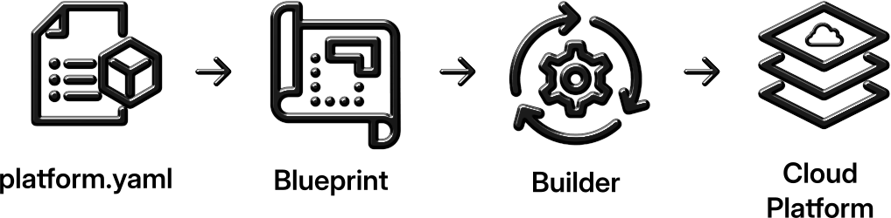
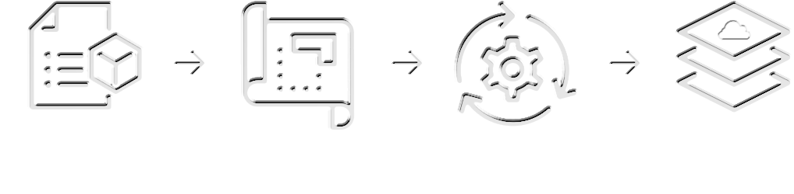

# Workflow and Usage of the Platform Specification

Let's now look into how to put the Platform Specification to good use...

The Platform Specification provides a structured approach to defining and managing cloud platforms in a consistent, repeatable manner. By following this workflow, organizations can seamlessly construct and manage their cloud platforms from definition to deployment using Infrastructure as Code (IaC) tooling. This section outlines the four-step process for utilizing the Platform Specification effectively.

{style="display: block; margin: 0 auto" .light-only}
{style="display: block; margin: 0 auto" .dark-only}

## Preface: The Components

**platform.yaml:**

**Blueprints:**

**Infrastructure as Code Builder/Engine:**

**Cloud Platform:**

## Step 1: Construct the `platform.yaml` (or `platform.json`)
The first step in building a cloud platform using the Platform Specification is writing the `platform.yaml` file. This YAML (or JSON) file acts as the blueprint for the entire platform, containing details about:

- **Infrastructure**: Cloud providers, regions, credentials, and machine images.
- **Compute and Networks**: Servers, clusters, managed services, and networking configurations.
- **Policies**: Cost management, scaling, logging, monitoring, backup and disaster recovery, governance, and alerting.
- **Security and Compliance**: Identity and access management, encryption, and regulatory requirements.
- **Developer Enablement**: Application and API services like serverless functions, message queues, and databases as a service.
- **Observability and Performance**: Monitoring, alerting, and performance optimization.

This file encapsulates all the essential components and configurations necessary for your cloud platform. It’s written following the Platform Specification format, which ensures a consistent structure and interoperability across tools and environments.

## Step 2: Select a Platform Blueprint
Once your `platform.yaml` is written, the next step is to select a **Platform Blueprint**. A Platform Blueprint is a predefined template that knows how to interpret your `platform.yaml` and transform it into an Infrastructure as Code (IaC) definition.

Using a Platform Blueprint simplifies the complexity of converting abstract platform configurations into real, deployable infrastructure. The Blueprint reads the configurations from `platform.yaml` and translates them into cloud-specific resources, like virtual machines, managed services, networks, and security policies.

Each Blueprint is designed to be flexible, allowing you to customize it for specific cloud providers, regions, or even unique operational needs. Whether your platform is being deployed on AWS, GCP, Azure, or a hybrid cloud, there’s likely a Blueprint tailored to your use case.

## Step 3: Apply the Infrastructure as Code (IaC) Using Builder/IaC Engine
With your Infrastructure as Code (IaC) definition generated from the Blueprint, the next step is to apply it. This can be done using any of the following IaC engines:

- **FoundationIO’s Metropolis**: A powerful tool that automates platform deployment and management across multiple clouds.
- **Terraform/OpenTofu**: Industry-standard IaC tools for provisioning and managing cloud infrastructure across a wide variety of providers.
- **CloudFormation**: A native IaC tool for AWS, allowing the creation and management of AWS resources.

The IaC engine of choice will interpret the output from the Platform Blueprint and deploy the resources into your cloud environment. Depending on your specific requirements, you can choose to apply the entire platform definition at once or iteratively deploy parts of it.

This stage ensures that all infrastructure resources defined in your `platform.yaml` are created, configured, and ready to use in your selected cloud environments.

## Step 4: Leverage Your Cloud Platform
With your infrastructure successfully deployed, your cloud platform is now ready to be leveraged for your business needs. You can begin using the platform for application development, data processing, or other workloads while adhering to the governance and policies you've predefined in the `platform.yaml` file.

At this stage, the platform operates as a fully functional, customizable environment, which you can scale, modify, and optimize over time as your needs evolve. Additionally, the standardized nature of the Platform Specification allows for continuous platform enhancements and consistent management across multiple environments.

## Summary
The workflow of the Platform Specification streamlines the process of defining, building, and managing cloud platforms. From writing the initial `platform.yaml` through selecting a Platform Blueprint, applying Infrastructure as Code, and finally leveraging the platform, this process allows organizations to accelerate cloud deployments with consistency and confidence. The standardized approach ensures that your platform is not only tailored to your specific needs but also scalable, maintainable, and governed by best practices in cloud infrastructure management.