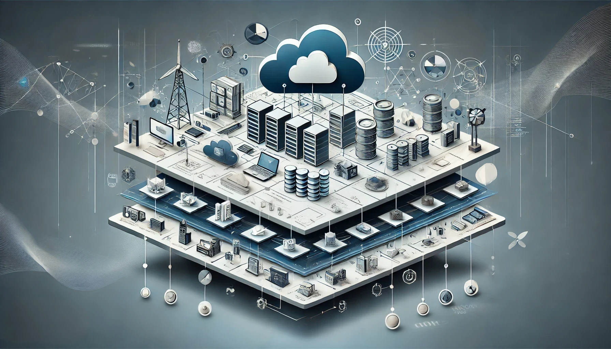

# What is an Infrastructure Platform?

## Infrastructure Platforms

In today’s landscape, businesses increasingly require platforms that enable rapid application development, deployment, and management. An **Infrastructure Platform** provides this capability by abstracting the complexities of managing infrastructure, creating an environment for developers and operators that allows them to focus on building and running software, rather than dealing with the underlying infrastructure. Infrastructure Platforms are built on top of **Infrastructure as a Service (IaaS)** and aim to provide a **Platform as a Service (PaaS)-like** experience, often referred to as a **cloud abstraction layer**.

Unlike raw IaaS, where users directly manage virtual machines, storage, and networking, an Infrastructure Platform layers additional services, automation, and orchestration, offering a streamlined operational model. In this context, the Infrastructure Platform becomes the intermediary between the infrastructure and the application layers, offering simplified deployment pipelines, resource management, service integration, and governance.

Infrastructure Platforms are built by assembling and integrating the services provided by **Infrastructure as a Service (IaaS)** providers, along with third-party services like **Software as a Service (SaaS)** solutions. This assembly creates a **cloud abstraction layer** that enables organizations to deliver and operate software in a more standardized and automated manner, abstracting the complexities of dealing with raw infrastructure.

## Defining an Infrastructure Platform

An **Infrastructure Platform** is an abstraction that automates the lifecycle of applications, services, and resources while leveraging the foundational elements provided by IaaS (e.g., compute, storage, network). It provides a self-service interface to developers and operators for managing applications without the need for direct interaction with lower-level infrastructure. This includes the ability to:

- **Provision resources**: Allocate compute, network, and storage resources in an abstract manner.
- **Manage services**: Integrate various platform services, such as databases, messaging queues, caching layers, and more.
- **Orchestrate workloads**: Automate the deployment, scaling, and monitoring of applications, whether containerized, serverless, or even traditional virtualized workloads.

A key characteristic of a Infrastructure Platform is its ability to integrate both **cloud-native** and **non-cloud-native** technologies into a unified operational model. It abstracts complexity while providing flexibility, allowing users to run modern microservices-based applications alongside more monolithic or legacy systems.

An **Infrastructure Platform** refers to a comprehensive set of cloud-based services, tools, and infrastructure that allows organizations to develop, deploy, manage, and scale applications and services in the cloud. It provides a foundational environment that abstracts much of the complexity of managing physical hardware, networking, and data centers, enabling users to focus on building and running their applications.

An **Infrastructure Platform** is essentially the backbone of modern digital infrastructure, providing the tools, services, and resources necessary to develop, deploy, and manage applications in a scalable, flexible, and efficient manner. It abstracts the complexities of traditional IT management, enabling organizations to focus on innovation, agility, and delivering value to their customers.

## Building a Infrastructure Platform on IaaS

Building anInfrastructure Platform atop sets of IaaS providers requires orchestrating several layers that can transform raw infrastructure into a manageable and scalable platform.

At its core, an IaaS provider offers essential cloud resources like virtual machines, storage, networking, and security. These resources form the **foundation** of any cloud platform. However, simply leveraging IaaS isn’t enough to provide a cohesive development and operational experience for an organization. An Infrastructure Platform brings together these basic components and layers additional services and automation on top to form a standardized environment for software delivery.

Key components include:

1. **Provisioning and Automation Layer**:
   This layer abstracts raw compute, storage, and networking resources provided by the underlying IaaS. Tools such as Terraform, Ansible, or cloud provider-specific SDKs are commonly used to automate infrastructure provisioning. On top of this, the platform introduces workflows that automate repetitive tasks like environment setup, resource scaling, and cluster management.

2. **Application and Service Management**:
   The platform includes mechanisms to deploy and manage applications, whether they are containerized, run on VMs, or use serverless computing models. Platforms often use tools like Helm, Docker Compose, or their own proprietary systems to manage applications across multiple environments, ensuring consistency between development, testing, and production.

3. **Resource Orchestration**:
   Orchestration engines such as **Kubernetes** or custom platforms handle the scheduling, scaling, and failure recovery of services across infrastructure resources. However, an Infrastructure Platform need not be tied to Kubernetes; it may also integrate legacy orchestration methods like VM-based autoscaling or server clustering techniques.

4. **Platform Services**:
   A mature Infrastructure Platform typically integrates common cloud services such as databases, load balancers, identity management, and messaging queues. These services are exposed to developers through APIs or service catalogs, ensuring consistency and integration across applications. The platform standardizes the configuration and deployment of these services, automating operational tasks such as backup, failover, and scaling.

5. **Governance and Policy Management**:
   A well-designed Infrastructure Platform enforces policies around cost management, resource usage, scaling limits, and security. This governance is particularly important in multi-cloud or multi-environment setups, where the platform ensures compliance and consistency regardless of the underlying provider. Automation around policies can range from tagging resources for cost tracking to automatically applying encryption or security standards to newly provisioned resources.

## Integrating SaaS Solutions and Platform Services

In addition to leveraging IaaS, Infrastructure Platforms often integrate **SaaS** solutions to provide higher-level services such as monitoring, logging, CI/CD pipelines, and identity management. Examples of commonly integrated SaaS solutions include:
- **Monitoring and Observability**: Services like Datadog, New Relic, or Prometheus can be integrated into the Infrastructure Platform to provide real-time insights into the performance of applications and infrastructure.
- **Logging and Auditing**: Cloud Platforms can incorporate solutions like Splunk, Elasticsearch, or Loki to capture and analyze logs for troubleshooting and security auditing.
- **Identity and Access Management (IAM)**: To secure the platform, SaaS solutions like Okta, Auth0, or native IaaS IAM services (e.g., AWS IAM) are integrated to enforce authentication and access control policies.
- **CI/CD Pipelines**: SaaS-based CI/CD platforms like GitLab, CircleCI, or Jenkins can be integrated to streamline the continuous integration and delivery processes, automating code deployment across environments.

These SaaS services provide specialized functionality, but when integrated into an Infrastructure Platform, they become part of a unified operational framework. This enables organizations to have a consistent, standardized approach to managing the entire software lifecycle, from development to production.

## Standardizing Software Delivery and Operations

By combining IaaS, SaaS, and orchestration, Infrastructure Platforms provide a **unified and standardized** approach to software delivery and operations. The Infrastructure Platform abstracts the differences between various underlying services, making it easier for developers and operators to build, deploy, and manage applications. This standardization offers several key benefits:

1. **Consistency**: Regardless of the cloud provider or SaaS solutions used, the Infrastructure Platform provides a consistent interface and operational model for deploying and managing applications.
2. **Scalability**: Infrastructure Platforms automate the scaling of infrastructure and applications, allowing them to handle varying workloads without manual intervention.
3. **Resilience**: Automated orchestration tools ensure that infrastructure and applications are monitored and managed for high availability, with failover mechanisms in place to recover from failures.
4. **Governance**: Infrastructure Platforms enforce governance policies, ensuring compliance with security, cost, and operational standards across environments. This may include enforcing resource quotas, automating encryption, or monitoring for security vulnerabilities.

Infrastructure Platforms also provide an interface for **self-service provisioning**, allowing developers to deploy and manage their applications without needing to understand the complexities of the underlying infrastructure. This self-service model speeds up development cycles and enables teams to work more independently, while still ensuring that platform policies and operational standards are followed.

## Technical Challenges in Infrastructure Platforms

Building and managing an Infrastructure Platform comes with several technical challenges, particularly when it spans multiple environments, cloud providers, or diverse workloads. Key challenges include:

- **Infrastructure Abstraction**: Each IaaS provider exposes a different set of primitives, APIs, and management tools. A Infrastructure Platform must abstract these differences to offer a unified experience across environments. This often involves building a common control plane to handle disparate resource management layers.
  
- **Application Lifecycle Management**: An Infrastructure Platform must offer tooling for managing the entire lifecycle of applications, including deployment, scaling, patching, and eventually decommissioning. This lifecycle management becomes complex in multi-cloud or hybrid environments, where each provider may have different capabilities for application lifecycle tasks.

- **Interoperability**: Infrastructure Platforms must be able to integrate both **cloud-native** and traditional technologies. For example, some environments might prefer Kubernetes for container orchestration, while others rely on traditional virtual machines or serverless technologies. The platform must manage these technologies in a way that doesn’t disrupt workflows.

- **Multi-cloud and Hybrid Cloud Orchestration**: Infrastructure Platforms that operate across multiple cloud providers or that bridge on-premises and cloud environments face additional orchestration challenges. The platform must reconcile differences in network topologies, security postures, and resource management APIs, providing a consistent user experience across diverse infrastructures.

- **Security and Compliance**: Each cloud provider and environment may impose different security and compliance requirements. A Infrastructure Platform must automate security best practices, such as encryption, identity management, access control, and auditing, ensuring compliance across the board.

## A Unified Infrastructure Abstraction Layer

A key advantage of Infrastructure Platforms is their ability to act as a **unified cloud abstraction layer**. This means that developers and operators can work with a single set of tools and APIs, regardless of the underlying infrastructure or service provider. This abstraction layer:

- Hides the complexity of dealing with multiple IaaS providers and SaaS integrations.
- Standardizes deployment pipelines, allowing teams to deploy applications in any environment with minimal friction.
- Provides a **cloud-agnostic** environment, where applications can run seamlessly across multiple cloud providers or even in hybrid cloud setups.

For organizations that operate in multi-cloud environments, this abstraction layer is crucial. It ensures that applications and services are **portable**, **scalable**, and **manageable** across different cloud infrastructures, without requiring significant re-engineering to adapt to each provider’s unique capabilities.

## The Need for a Standardized Platform Specification

Given the complexity of building and managing Infrastructure Platforms, particularly in multi-cloud or hybrid scenarios, there is a growing need for **standardization**. Today, many organizations create custom platforms tailored to their specific use cases, resulting in fragmented approaches to platform design, management, and governance. This lack of consistency leads to operational inefficiencies, increased risk, and challenges in scaling.

A **Platform Specification** offers a standardized, community-driven approach to defining what constitutes a cloud platform, providing a common language and framework for:
- Defining **infrastructure** and services.
- Managing **application lifecycles**.
- Implementing **governance policies**.
- Integrating with both **cloud-native** and **traditional** tools and services.

By standardizing the way Infrastructure Platforms are defined and operated, organizations can achieve greater consistency and reusability across their environments. This reduces complexity, accelerates platform delivery, and ensures that operational best practices are baked into the platform from the start.

A standardized Platform Specification helps in abstracting the underlying complexity of IaaS providers, ensuring that developers and operators can build and manage applications without the need to constantly adapt to infrastructure-level changes. Whether running containerized microservices, monolithic applications, or hybrid workloads, the specification acts as a blueprint for building platforms that scale, adapt, and evolve with the business.

The shift towards Infrastructure Platforms built on top of IaaS reflects the need for more sophisticated, automated, and developer-friendly environments. By abstracting infrastructure and providing a PaaS-like experience, Infrastructure Platforms allow organizations to focus on innovation, while the complexities of resource management, scaling, and service orchestration are handled automatically. A standardized Platform Specification ensures that these platforms can be consistently defined and operated, across any environment, delivering a unified experience to both developers and operators.

By adopting a standardized **Platform Specification**, organizations can ensure that their Infrastructure Platforms are built and managed consistently across environments, enabling faster innovation, reducing operational complexity, and improving resilience in a cloud-driven world.